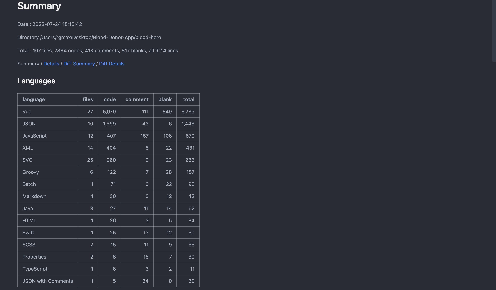
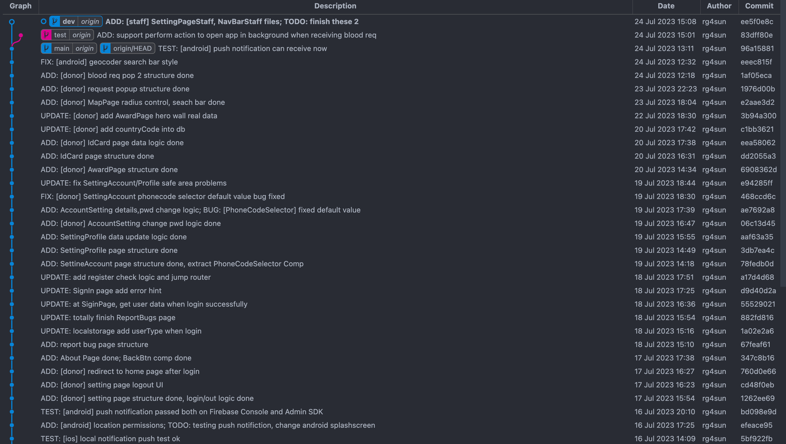
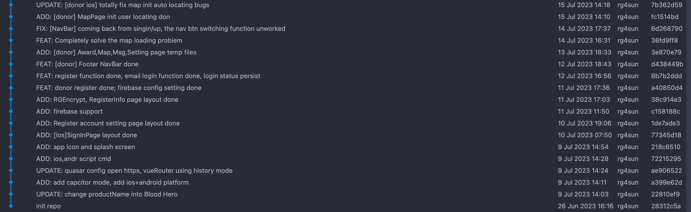

# Blood Hero App (hybrid-test)

**Author:** rg4sun

**Contact:** rg4sun@gmail.com/@163.com

All rights reserved.

## UI Prototypes

The UI Prototypes are totally designed by R.G.(rg4sun) using Figma. 

## Updating

The Blood Hero App is being cooked by R.G.(rg4sun). Please wait warmly until it is ready.

The actual Blood Hero App source code (updated daily) is hosted on Git Soton at

+  [hs5n22 / Blood-Hero · GitLab (soton.ac.uk)](https://git.soton.ac.uk/hs5n22/blood-hero) 
+ [hs5n22 / Blood-Hero-Server · GitLab (soton.ac.uk)](https://git.soton.ac.uk/hs5n22/blood-hero-server)

and will not be released to Github until the MSc Project is officially completed.

## Progress

