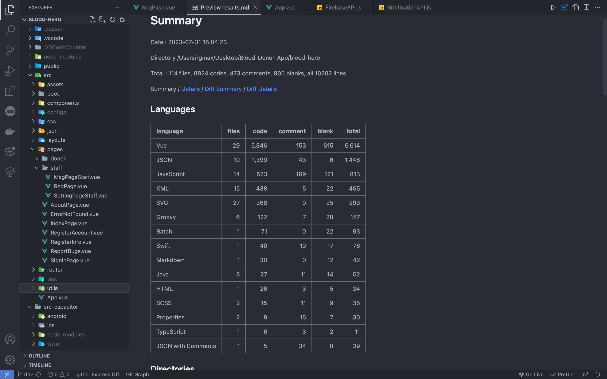
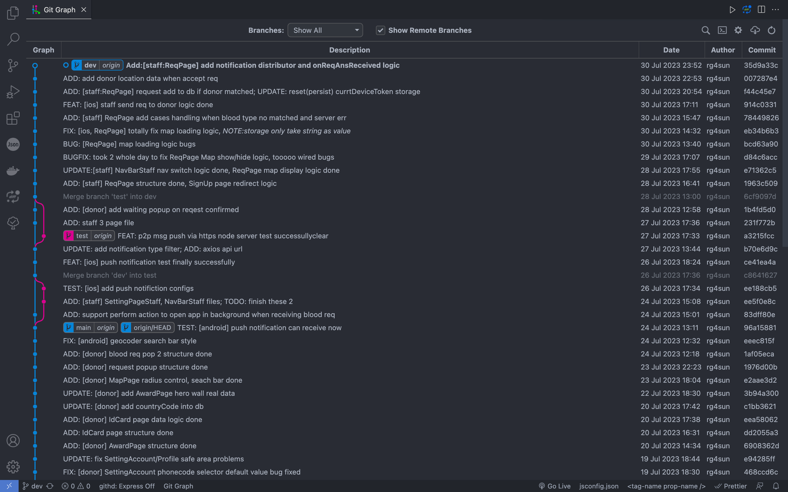
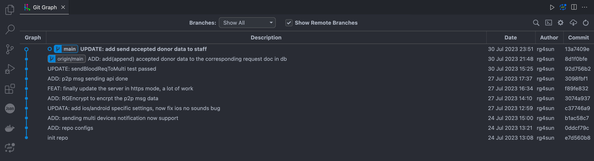

# Blood Hero App (hybrid-test)

**Author:** rg4sun

**Contact:** rg4sun@gmail.com/@163.com

All rights reserved.

> 本项目使用 **跨平台混合开发技术** 实现。
>
> 借助 Quasar(Vue) + Capacitor 实现 Web Native Apps。
>
> 简单来说，使用 Web 技术开发，通过Capactiro 提供 mobie native runtime 将 web code 生成 mobile native code (iOS:Swift, Android: Kotlin/Java)，达到一码多用，多平台设计统一的跨平台App实现。

## 技术框架

+ **UI 设计：** Figma

+ **前端框架：**Quasar(Vue Based)
+ **UI 框架:** Quasar UI Components
+ **移动端跨平台Runtime：**Capacitor
  + 移动端生成代码（Mobile Native Code）:
    + iOS: Swift
    + Android: Kotlin, Java
+ **地图相关模块实现：**Mapbox + Capacitor Geolocation Plugin
+ **消息推送模块实现：**
  + Capacitor Push Notification Plugin + Firebase Cloud Messaging (FCM) + Apple Push Notification service (APNs)
+ **移动端设备缓存：** Capacitor Preferences Plugin
+ **后台任务实现：**Capacitor Background Runner Plugin
+ **相机模块+扫码模块实现：**
  + Capacitor Camera Plugin + Barcode Scanner Plugin + JsBarcode + QRCode.js
+ **后台服务器：**Node + Express
+ **云数据库：**Cloud Firebase（Non-SQL）
+ **语法规范工具：**ESLint + Prettier
+ **打包工具：**Vite

## UI Prototypes

The UI Prototypes are totally designed by R.G.(rg4sun) using Figma. 

## Updating

The Blood Hero App is being cooked by R.G.(rg4sun). Please wait warmly until it is ready.

The actual Blood Hero App source code (updated daily) is hosted on Git Soton at

+  [hs5n22 / Blood-Hero · GitLab (soton.ac.uk)](https://git.soton.ac.uk/hs5n22/blood-hero) 
+ [hs5n22 / Blood-Hero-Server · GitLab (soton.ac.uk)](https://git.soton.ac.uk/hs5n22/blood-hero-server)

and will not be released to Github until the MSc Project is officially completed.

## Progress

### Client App Side

### Blood Hero Server 

